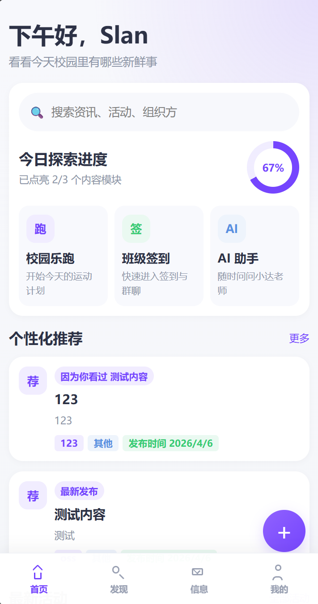
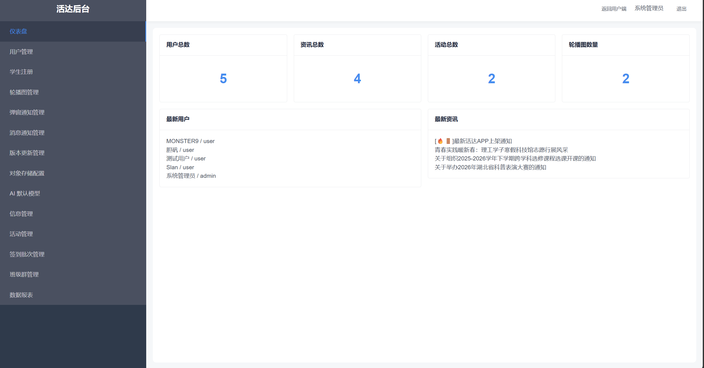

# 活达校园平台

> 一个面向校园场景的一体化项目仓库，包含 `uni-app` 用户端、`Node.js` 服务端，以及基于开源项目二次开发的 `Vue2 + iView` 管理后台。

[](https://www.huoda.xyz)
[](#环境要求)
[](#技术栈)
[](#快速开始)
[](#license)

## 项目简介

活达校园平台聚焦校园内容分发、活动组织、班级签到、乐跑记录、消息通知与后台管理等场景，目标是把学生端体验、管理员运营能力和服务端数据能力放进同一个仓库里统一维护。

这个仓库当前由 3 个核心部分组成：

- `huoda_uniapp`：用户端，基于 `uni-app + Vue2`
- `server`：服务端，基于 `Node.js + Express + SQLite`
- `vue2-iview2-admin`：管理后台，基于 `Vue2 + iView`，并在同名开源项目基础上进行了业务化改造

## 在线演示

- 演示地址：https://www.huoda.xyz
- 仓库地址：https://github.com/XtSilan/huoda_uniapp

## 重要说明

> `huoda_uniapp` 用户端请使用 **HBuilderX** 打开 `huoda_uniapp/` 子目录进行编译和运行。  
> 当前项目文档不提供“仅通过 npm 命令直接编译用户端”的流程，请以 HBuilderX 为准。

> `vue2-iview2-admin` 不是从零新建的后台，而是基于开源项目 `vue2-iview2-admin` 进行二次开发、接口接入和页面改造后的版本。

## 目录

- [项目简介](#项目简介)
- [在线演示](#在线演示)
- [重要说明](#重要说明)
- [效果预览](#效果预览)
- [核心功能](#核心功能)
- [项目结构](#项目结构)
- [技术栈](#技术栈)
- [环境要求](#环境要求)
- [快速开始](#快速开始)
- [运行说明](#运行说明)
- [环境变量](#环境变量)
- [默认数据](#默认数据)
- [常见问题](#常见问题)
- [致谢](#致谢)
- [License](#license)

## 效果预览

### 用户端



### 管理后台



## 核心功能

### 用户端 `huoda_uniapp`

- 校园首页聚合推荐，支持焦点推荐、热门资讯、活动内容浏览
- 校园乐跑模块，支持开始跑步、历史记录、排行榜展示
- 班级签到模块，支持签到批次、请假流程、班级群聊
- 资讯与活动模块，支持发布内容浏览、详情查看、收藏与历史记录
- AI 助手入口，支持接入默认模型配置
- 个人中心模块，支持资料编辑、通知、统计、个性化设置与后台跳转

### 服务端 `server`

- 提供用户端与后台共用的 REST API
- 使用 `SQLite` 作为本地开发数据库，开箱即可初始化
- 提供用户、资讯、活动、签到、班级群、通知、更新等业务接口
- 支持媒体资源上传、附件访问、对象存储配置与本地/OSS 切换

### 管理后台 `vue2-iview2-admin`

- 仪表盘总览
- 用户管理与学生注册
- 轮播图、弹窗通知、消息通知管理
- 资讯管理、活动管理、附件上传
- 签到批次管理、请假审核、班级群管理
- Android 更新发布、媒体库、对象存储配置、AI 默认模型配置、数据报表

## 项目结构

```text
huoda_uniapp/
├─ huoda_uniapp/           # uni-app 用户端（请用 HBuilderX 打开此目录）
├─ server/                 # Node.js + Express 服务端
├─ vue2-iview2-admin/      # Vue2 + iView 管理后台（二次开发版）
├─ user_index.png          # 用户端展示图
├─ admin_index.png         # 后台展示图
└─ README.md
```

更细一点的职责可以这样理解：

- `huoda_uniapp/pages/`：用户端业务页面
- `huoda_uniapp/services/`：用户端接口请求封装
- `server/src/`：服务端路由、数据库、存储能力
- `vue2-iview2-admin/src/pages/`：后台管理页面

## 技术栈

| 模块 | 技术 |
| --- | --- |
| 用户端 | `uni-app`、`Vue2` |
| 服务端 | `Node.js`、`Express` |
| 数据层 | `SQLite` |
| 管理后台 | `Vue2`、`iView`、`Axios`、`Webpack 2` |
| 存储能力 | 本地上传、阿里云 OSS |
| AI 配置 | 默认模型配置、可接 OpenAI 兼容接口 |

## 环境要求

- Node.js `>= 22`
- npm `>= 10`
- HBuilderX 最新版

## 快速开始

### 1. 克隆项目

```bash
git clone https://github.com/XtSilan/huoda_uniapp.git
cd huoda_uniapp
```

### 2. 安装依赖

在仓库根目录分别执行：

```bash
cd huoda_uniapp
npm install
cd ..
```

```bash
cd server
npm install
cd ..
```

```bash
cd vue2-iview2-admin
npm install
cd ..
```

### 3. 初始化服务端数据库

```bash
cd server
npm run db:init
```

### 4. 启动服务端

```bash
cd server
npm run dev
```

默认地址：`http://127.0.0.1:3000`

### 5. 启动管理后台

```bash
cd vue2-iview2-admin
npm run dev
```

默认地址通常为：`http://127.0.0.1:8081/#/login`

### 6. 启动用户端

1. 打开 **HBuilderX**
2. 选择 `文件 -> 打开目录`
3. 选中仓库中的 `huoda_uniapp/` 子目录，不是仓库根目录
4. 在 HBuilderX 中执行运行或发行

可选运行目标：

- H5
- 微信小程序
- App

## 运行说明

### 用户端 `huoda_uniapp`

- 请使用 HBuilderX 运行
- 先执行过一次 `npm install` 再打开更稳妥
- 即使目录中保留了 `uni-app` 相关脚本，也建议把 HBuilderX 作为实际编译入口

### 服务端 `server`

```bash
npm run db:init
npm run dev
```

### 管理后台 `vue2-iview2-admin`

```bash
npm run dev
npm run build
```

## 环境变量

### 用户端 `huoda_uniapp/.env`

```env
VUE_APP_SERVER_ORIGIN=http://127.0.0.1:3000
VUE_APP_BASE_URL=http://127.0.0.1:3000/api
VUE_APP_ADMIN_ORIGIN=http://127.0.0.1:8081
VUE_APP_ADMIN_LOGIN_URL=http://127.0.0.1:8081/#/login
```

### 管理后台 `vue2-iview2-admin/.env`

```env
API_BASE_URL=http://127.0.0.1:3000/api
USER_APP_URL=http://127.0.0.1:8080/#/pages/user/user
```

### 服务端

服务端默认监听：

- `PORT=3000`
- `PUBLIC_HOST=127.0.0.1`

如需扩展部署能力，可按 `server/src/index.js` 中的读取逻辑补充服务端环境变量。

## 默认数据

在 `server/` 目录执行 `npm run db:init` 后，服务端会初始化数据库，并自动写入基础数据。

默认管理员账号：

- 账号：`admin`
- 密码：`admin`

这套默认数据主要用于本地开发联调，部署前请自行修改。

## 常见问题

### 1. 为什么用户端不能像普通 Vue 项目那样直接 `npm run dev`？

因为这个仓库里的用户端实际以 **HBuilderX 编译链路** 为准，README 也以这个流程作为标准启动方式。最稳妥的做法是先安装依赖，再使用 HBuilderX 打开 `huoda_uniapp/` 子目录运行。

### 2. 为什么 HBuilderX 打不开项目？

- 确认打开的是 `huoda_uniapp/` 子目录
- 确认已经在该目录执行过 `npm install`
- 确认本机 Node.js 与 HBuilderX 版本正常

### 3. 页面能打开，但接口请求失败怎么办？

- 确认 `server` 已运行在 `http://127.0.0.1:3000`
- 检查 `huoda_uniapp/.env` 中的 `VUE_APP_BASE_URL`
- 检查 `vue2-iview2-admin/.env` 中的 `API_BASE_URL`

### 4. 后台登录不上怎么办？

- 先进入 `server/` 目录执行 `npm run db:init`
- 再启动服务端与后台
- 本地初始化后可先使用默认管理员账号 `admin / admin`

## 致谢

- 管理后台基础项目来源：`vue2-iview2-admin`
- 上游仓库：https://github.com/hanjiangxueying/vue2-iview2-admin

## License

MIT
