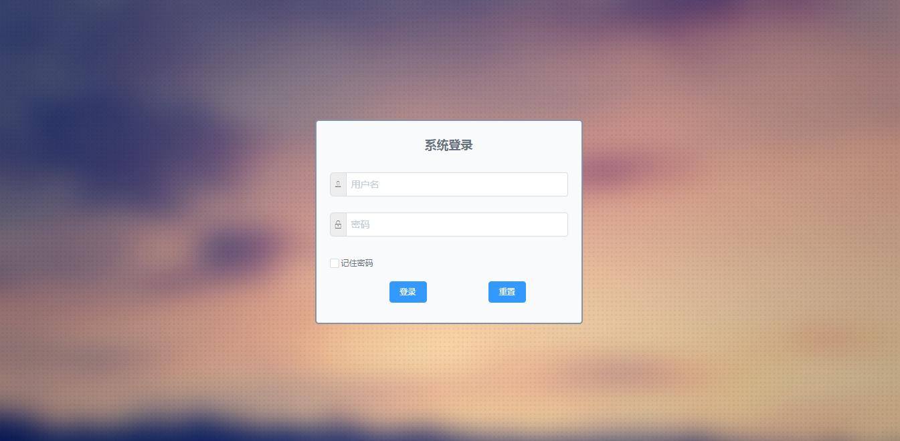

# 活达管理后台

> `vue2-iview2-admin` 在上游开源项目基础上进行了业务化改造，用于支撑活达校园平台的运营配置、内容管理和数据管理。

## 说明

- 本目录是活达项目的后台管理端，不是原始上游仓库的直接镜像
- 完整项目说明请优先查看仓库根目录 [`README.md`](../README.md)
- 上游项目地址：https://github.com/hanjiangxueying/vue2-iview2-admin

## 当前模块

- 仪表盘
- 用户管理与学生注册
- 轮播图管理
- 弹窗通知管理
- 消息通知管理
- 版本更新管理
- 对象存储配置
- 媒体库
- AI 默认模型配置
- 资讯管理
- 活动管理
- 签到批次管理
- 班级群管理
- 数据报表

## 本地运行

```bash
npm install
npm run dev
```

默认开发地址通常为：`http://127.0.0.1:8081/#/login`

## 构建

```bash
npm run build
```

## 环境变量

`.env`

```env
API_BASE_URL=http://127.0.0.1:3000/api
USER_APP_URL=http://127.0.0.1:8080/#/pages/user/user
```

## 登录说明

该后台依赖 `server` 服务端接口与数据库初始化结果。

如果你是首次本地运行：

1. 先进入仓库 `server/` 目录执行 `npm run db:init`
2. 启动 `server`
3. 再启动当前后台
4. 默认管理员账号为 `admin / admin`

## 截图




